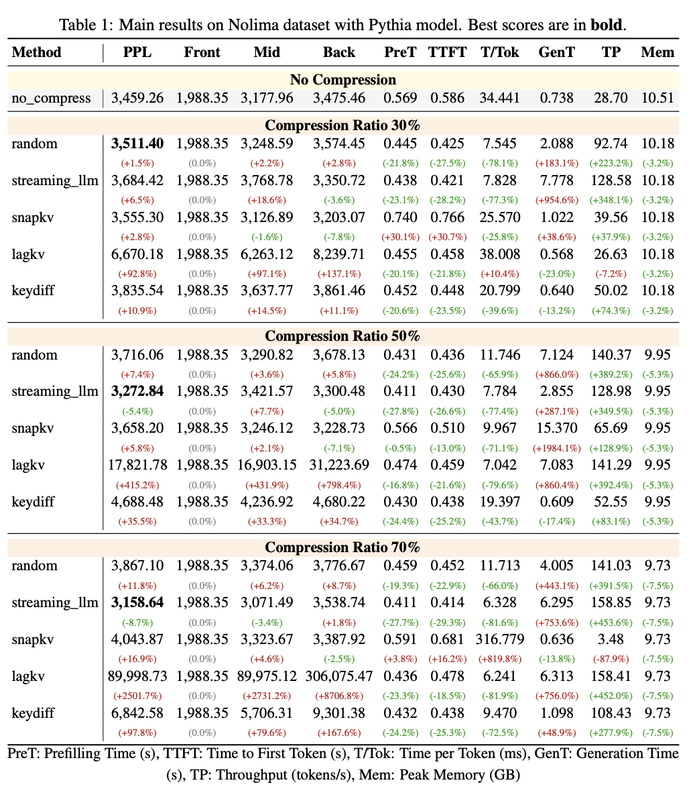
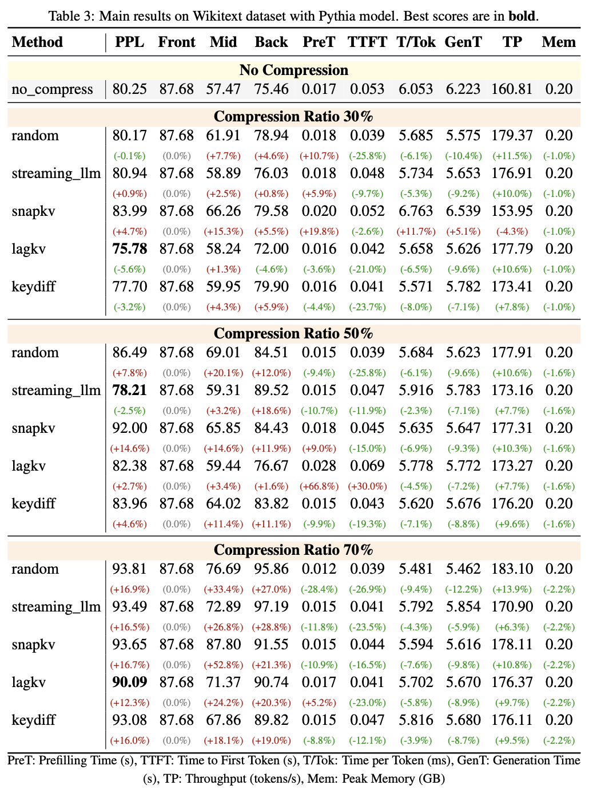
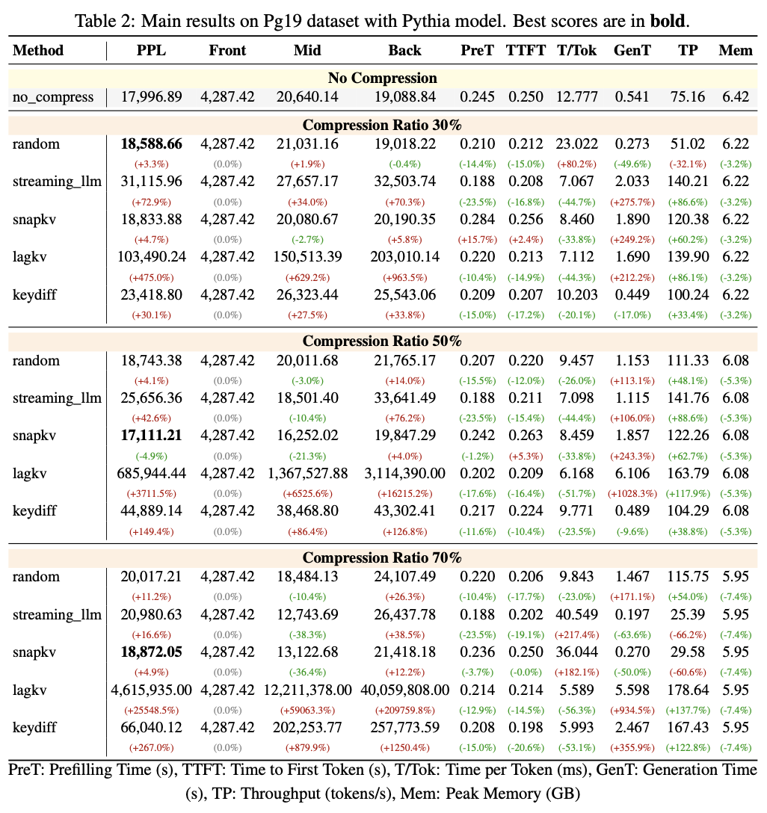
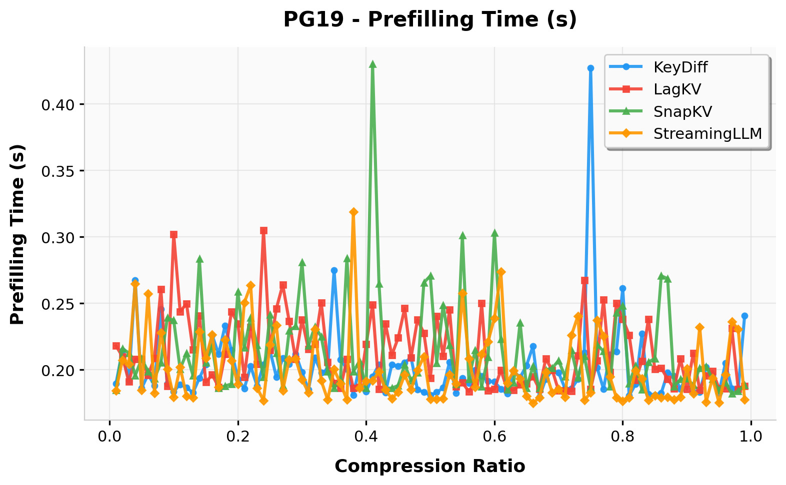
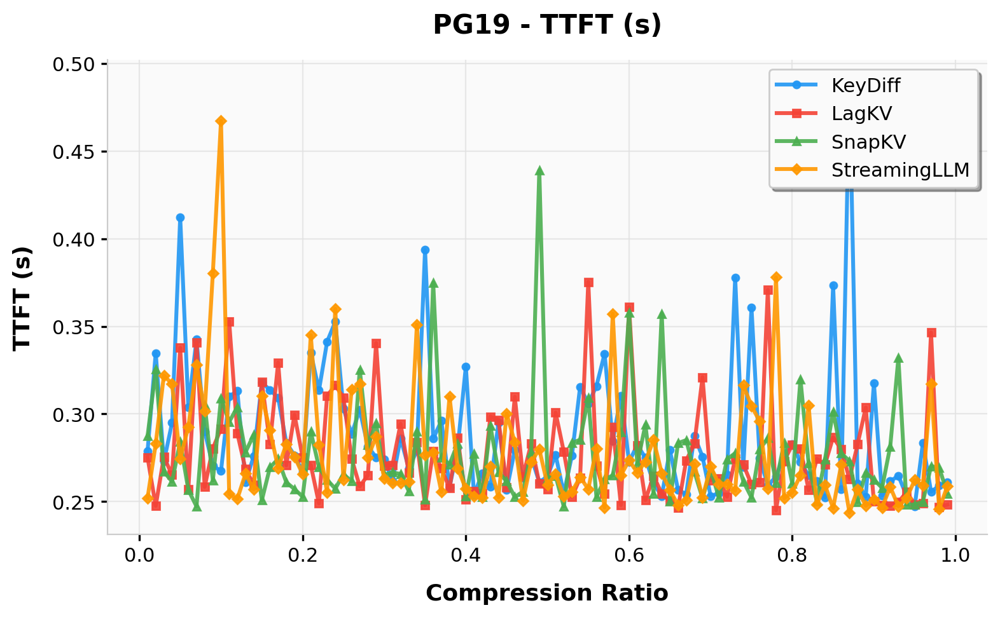
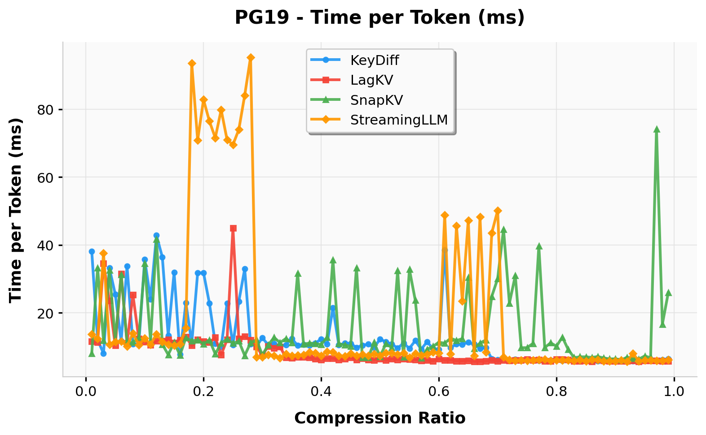
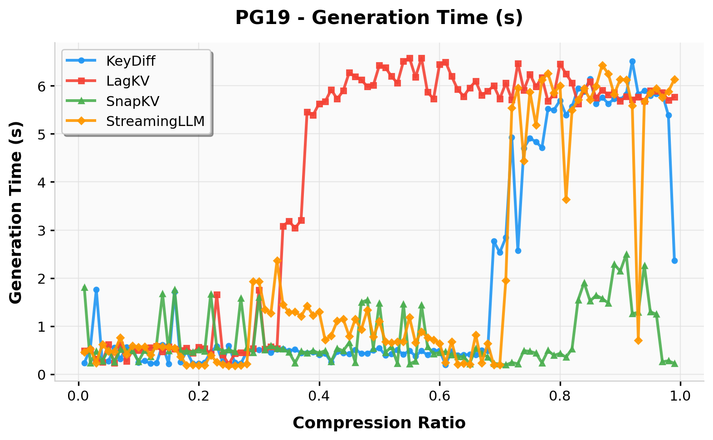
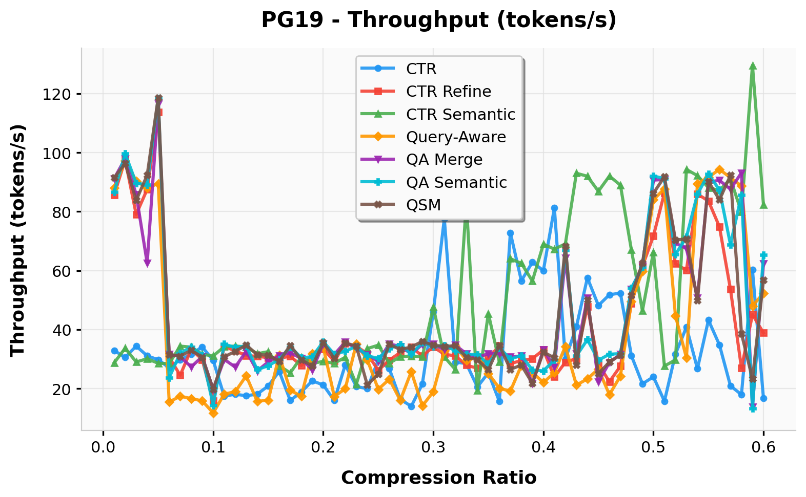
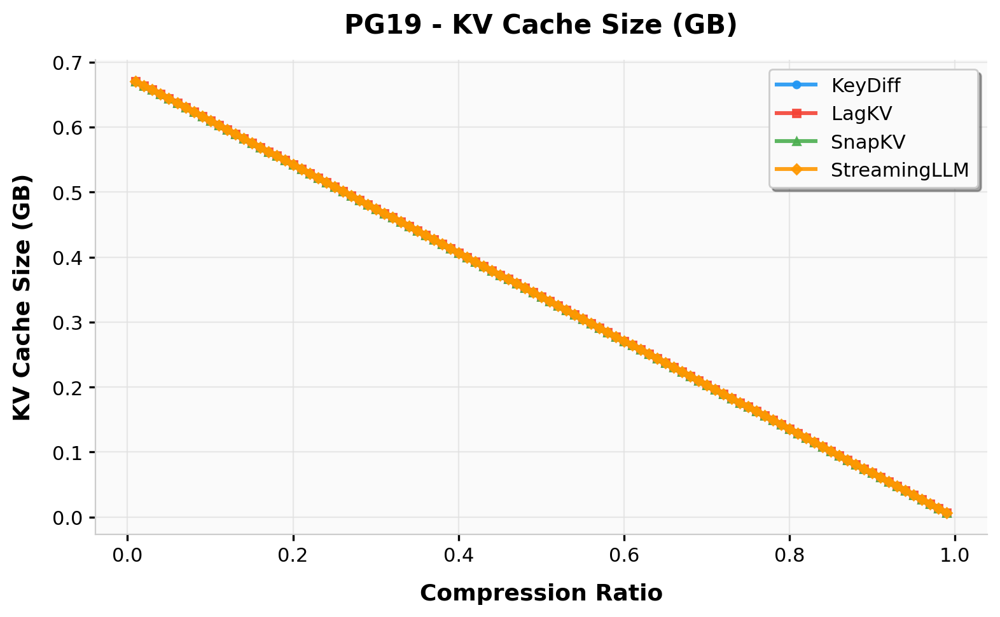

# EfficientNLP: KV Cache Compression Benchmark

A secondary development built on top of [kvpress](https://github.com/NVIDIA/kvpress) (NVIDIA), focusing on systematic evaluation and analysis of KV cache compression methods.

## Outline

- [Introduction](#introduction)
  - [Evaluation Metrics](#evaluation-metrics)
  - [Supported Compression Methods](#supported-compression-methods)
- [Baseline Reproduction](#baseline-reproduction)
  - [Environment Setup](#environment-setup)
  - [Installation](#installation)
  - [Result Analysis](#result-analysis)
  - [Main Table Analysis](#main-table-analysis)
  - [Ablation Study: Compression Rate vs. Efficiency](#ablation-study-compression-rate-vs-efficiency)
- [Our Novel KVPress Algorithm](#our-novel-kvpress-algorithm)
- [Project Structure](#project-structure)
- [Acknowledgements](#acknowledgements)
- [License](#license)

## Introduction

KV cache is one of the core bottlenecks during Transformer inference — the linearly growing key-value cache consumes enormous memory. For example, handling 1M tokens with Llama 3.1-70B in float16 requires up to 330GB of memory for KV cache alone.

This project extends the kvpress framework with an **end-to-end evaluation pipeline** that supports batch experiments across multiple datasets, models, and compression methods. It also provides result analysis and visualization tools, enabling systematic comparison of different KV cache compression approaches across three dimensions: **language modeling quality**, **inference efficiency**, and **memory usage**.

### Evaluation Metrics

| Dimension | Metric | Description |
|-----------|--------|-------------|
| **Language Modeling Quality** | PPL | Perplexity (lower is better) |
| | Front / Mid / Back PPL | Perplexity on the front/middle/back 1/3 of the text, reflecting information retention at different positions |
| **Inference Efficiency** | Prefilling Time | Prefilling duration (s) |
| | TTFT | Time to First Token (s) |
| | Time per Token | Per-token generation time (ms) |
| | Generation Time | Total generation time (s) |
| | Throughput | Throughput (tokens/s) |
| **Memory Efficiency** | KV Cache Size | KV cache tensor size (GB) |

### Supported Compression Methods

| Method | Type | Description |
|--------|------|-------------|
| `no_compress` | Baseline | No compression, serves as upper-bound reference |
| `random` | ScorerPress | Random scoring, serves as lower-bound reference |
| `streaming_llm` | Special logic | Keeps only initial + recent tokens ([paper](https://arxiv.org/abs/2309.17453)) |
| `snapkv` | ScorerPress | Average attention weight from the last queries ([paper](https://arxiv.org/abs/2404.14469)) |
| `lagkv` | ScorerPress | Compression based on KV lag-relative information, query/attention-free ([paper](https://arxiv.org/abs/2504.04704)) |
| `keydiff` | ScorerPress | Eviction based on key similarity ([paper](https://arxiv.org/abs/2504.15364)) |

> For the full list of kvpress-supported methods, see [README4kv_press.md](README4kv_press.md).

## Baseline Reproduction

### Environment Setup

- **CUDA**: 12.9
- **Python**: 3.11.14
- **GPU**: NVIDIA GPUs

### Installation

```bash
# Clone the repository
git clone <your-repo-url>
cd EfficientNLP

# Install dependencies with uv (recommended)
uv sync

# Install optional dependencies (evaluation metrics + Flash Attention)
uv sync --extra eval --extra flash-attn

# Activate the virtual environment
source .venv/bin/activate
```

Models and datasets are required: 
- **Models**: Place model files under the `models/` directory
  - `models/pythia/` — Pythia model (https://huggingface.co/EleutherAI/pythia-70m)
  - `models/qwen_3_1.7b/` — Qwen3-1.7B model (https://huggingface.co/Qwen/Qwen3-1.7B)
- **Datasets**: Place dataset files under the `data/` directory
  - `data/pg19/` — PG-19 long-text dataset (https://huggingface.co/datasets/emozilla/pg19)
  - `data/wikitext/` — WikiText-103 dataset (https://huggingface.co/datasets/Salesforce/wikitext)
  - `data/NoLiMa/` — NoLiMa long-context QA dataset (https://huggingface.co/datasets/amodaresi/NoLiMa)


**Main table experiments**

```bash
# Usage: bash run_maintable.sh <MODEL> <PRESS_METHOD>
# Examples:
bash run_maintable.sh pythia snapkv
bash run_maintable.sh qwen_3_1.7b lagkv
```

**Ablation experiments**

```bash
# Usage: bash ablation_compression_rate.sh <PRESS_METHOD>
# Fixed: pythia model, pg19 dataset
# Examples:
bash ablation_compression_rate.sh snapkv
bash ablation_compression_rate.sh keydiff
```

Manual Execution directly using `main.py` is also available:

```bash
python main.py \
    --dataset pg19 \
    --model pythia \
    --compress_ratio 0.5 \
    --press_method snapkv \
    --max_new_tokens 1000 \
    --n_repeats 3 \
    --max_samples 1 \
    --output_dir results
```

**Parameters**:

| Parameter | Options | Description |
|-----------|---------|-------------|
| `--dataset` | `nolima`, `pg19`, `wikitext` | Evaluation dataset |
| `--model` | `pythia`, `qwen_3_1.7b` | Model |
| `--compress_ratio` | 0.0 ~ 1.0 | Compression ratio |
| `--press_method` | `no_compress`, `random`, `streaming_llm`, `snapkv`, `lagkv`, `keydiff` | Compression method |
| `--max_new_tokens` | integer | Maximum number of tokens to generate |
| `--n_repeats` | integer | Number of repeated measurements per metric |
| `--max_samples` | integer | Maximum number of samples |
| `--output_dir` | path | Output directory for results |


### Result Analysis

Experiment results are saved under `results/` (main table) and `results_ablation/` (ablation study), with each run generating a separate subdirectory containing:

- `results.json` — Detailed per-sample, per-repeat measurement results
- `summary.json` — Aggregated statistics (mean/std/min/max) for each metric

```bash
# Generate Summary Tables (CSV)
cd analyze
python analyze_main_table.py
```

Outputs CSV files under `analyze/tables/`, one per `(dataset, compression_ratio)` combination.

```bash
# Generate Ablation Plots
cd analyze
python analyze_ablation_table.py
```

Outputs PDF plots under `analyze/images/`, showing metric trends across different compression ratios for each method.

### Main Table Analysis

We evaluate 5 compression methods + no-compression baseline on the Pythia model across three datasets (NoLiMa, WikiText-103, PG-19) at compression ratios of 30%, 50%, and 70%.

**Key observations:**

- **WikiText-103** (short-context, ~80 PPL baseline): Methods behave similarly at low compression. At 30% ratio, `lagkv` (75.78) slightly outperforms the uncompressed baseline, suggesting denoising effects. As compression increases to 70%, all methods degrade gracefully with PPLs staying within 90-94.
- **NoLiMa** (long-context QA, ~3459 PPL baseline): `streaming_llm` is the most stable method across all ratios, maintaining competitive PPL. `lagkv` suffers severe degradation at higher ratios (PPL explodes to 90K at 70%), indicating its lag-relative scoring discards critical information in long-range dependency tasks.
- **PG-19** (long book texts, ~18K PPL baseline): `lagkv` catastrophically fails at high compression (PPL reaches 4.6M at 70%), while `snapkv` and `streaming_llm` remain relatively robust. `keydiff` shows moderate degradation.
- **Inference efficiency**: All compression methods reduce KV cache size and improve throughput compared to the baseline. `streaming_llm` and `lagkv` achieve the lowest per-token latency due to their simpler scoring mechanisms.
- **Front PPL is preserved**: Across all settings, `front_ppl` (first 1/3 of text) remains close to the baseline, as compression is applied after prefilling the initial context.

<table>
<tr>
<td></td>
<td></td>
<td></td>
</tr>
</table>

### Ablation Study: Compression Rate vs. Efficiency

We sweep compression ratios from 0.01 to 0.99 (100 points) on the PG-19 dataset with the Pythia model to analyze how each method's performance and efficiency scale with the degree of compression.

**Key observations:**

- **Prefilling Time**: `snapkv` has higher prefilling overhead at low compression due to its attention-score computation. Other methods maintain near-constant prefilling time regardless of compression ratio.
- **TTFT (Time to First Token)**: Follows a similar trend to prefilling time. Higher compression generally reduces TTFT as fewer KV pairs need to be processed.
- **Time per Token & Generation Time**: Decrease monotonically with higher compression, as a smaller KV cache speeds up autoregressive decoding. `streaming_llm` and `lagkv` achieve the lowest per-token latency.
- **Throughput**: Increases with compression ratio. The relationship is roughly linear for most methods, with `lagkv` and `streaming_llm` achieving the highest throughput at aggressive compression.
- **KV Cache Size**: Decreases linearly with the compression ratio for all methods, confirming the expected memory savings.

<table>
<tr>
<td></td>
<td></td>
<td></td>
</tr>
<tr>
<td></td>
<td></td>
<td></td>
</tr>
</table>


## Our Novel KVPress Algorithm

> TODO: Add description of the custom compression method here


## Project Structure

```
EfficientNLP/
├── main.py                          # Main evaluation entry point
├── evaluator.py                     # Core evaluator (KVCacheEvaluator)
├── run_maintable.sh                 # Batch script for main table experiments
├── ablation_compression_rate.sh     # Batch script for ablation study
├── pyproject.toml                   # Project configuration & dependencies
├── kvpress/                         # kvpress core library (upstream + custom)
│   ├── __init__.py                  # Press registration & exports
│   ├── pipeline.py                  # KVPressTextGenerationPipeline
│   ├── attention_patch.py           # Attention function patches
│   ├── utils.py
│   └── presses/                     # Compression method implementations
│       ├── base_press.py            # BasePress base class
│       ├── scorer_press.py          # ScorerPress base class
│       ├── snapkv_press.py
│       ├── lagkv_press.py
│       ├── keydiff_press.py
│       ├── streaming_llm_press.py
│       └── ...                      # More methods
├── analyze/                         # Result analysis tools
│   ├── analyze_main_table.py        # Generate CSV summaries from results/
│   ├── analyze_ablation_table.py    # Ablation study visualization
│   ├── generate_tables.py           # Generate LaTeX tables
│   ├── tables/                      # CSV output
│   └── images/                      # PDF plot output
├── data/                            # Datasets (prepare separately)
│   ├── pg19/
│   ├── wikitext/
│   └── NoLiMa/
├── models/                          # Model weights (prepare separately)
│   ├── pythia/
│   └── qwen_3_1.7b/
├── results/                         # Main table experiment results
├── results_ablation/                # Ablation experiment results
├── evaluation/                      # kvpress native evaluation framework
├── tests/                           # Tests
├── notebooks/                       # Demo notebooks
└── README4kv_press.md               # Original kvpress README
```


## Acknowledgements

This project is built upon NVIDIA's open-source [kvpress](https://github.com/NVIDIA/kvpress) library. We gratefully acknowledge the original authors for their contribution.

## License

Apache-2.0
