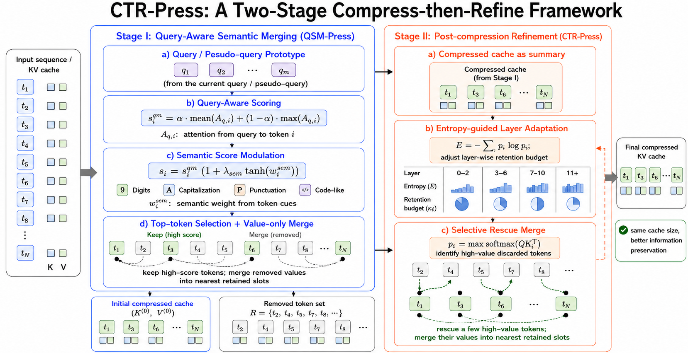
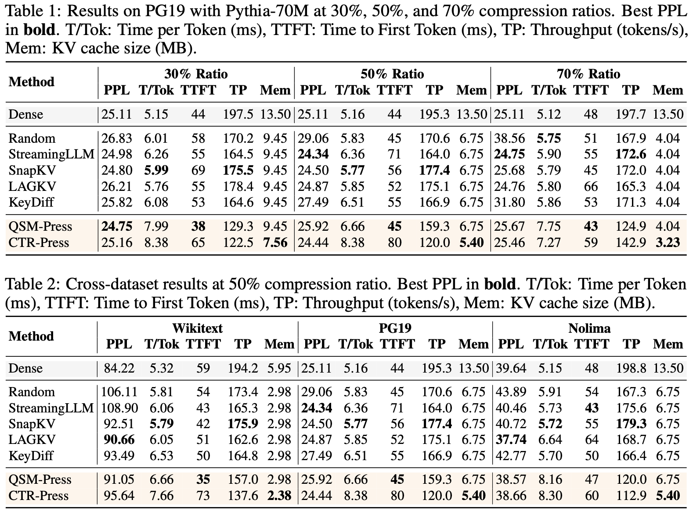
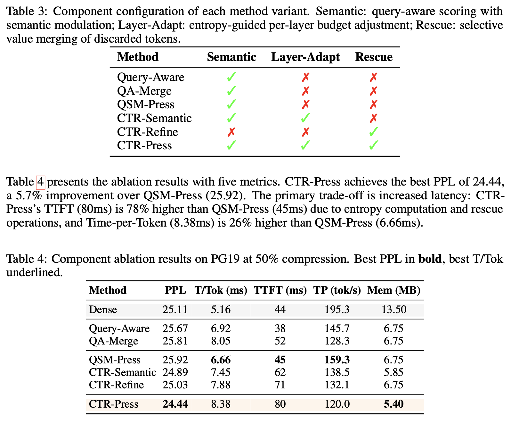
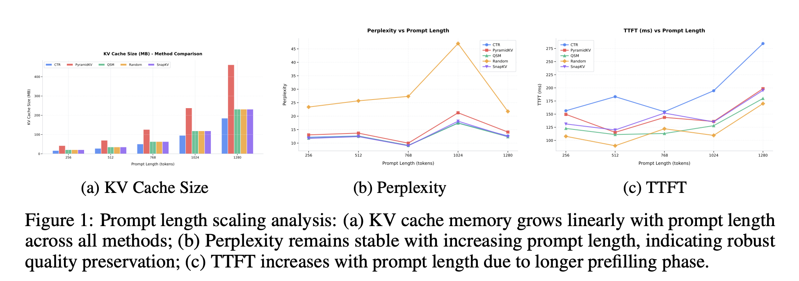
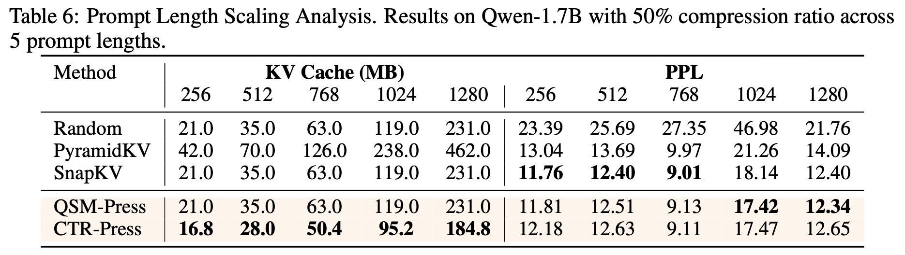
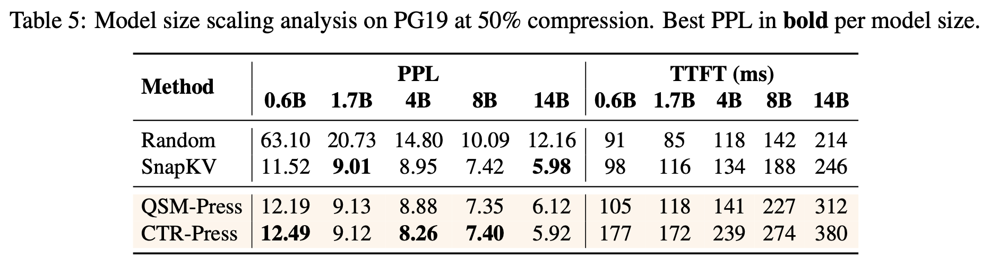
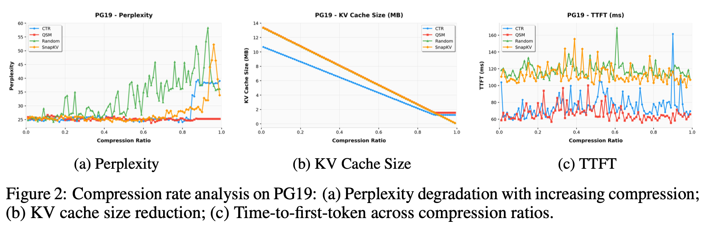

# CTR-Press: Compress-then-Refine for Training-Free KV Cache Compression

A novel two-stage framework for training-free KV cache compression that introduces a refinement mechanism to correct errors from initial compression decisions.

[](https://opensource.org/licenses/Apache-2.0)
[](https://opensource.org/licenses/Apache-2.0)
[](./ctr_press.pdf)

<!-- Placeholder: Architecture diagram showing the two-stage CTR-Press framework -->
<p align="center">
  
</p>

## Table of Contents

- [Introduction](#introduction)
  - [The KV Cache BottleNeck](#the-kv-cache-bottleneck)
  - [Limitation of Existing Methods](#limitations-of-existing-methods)
  - [Our Approach](#our-approach-ctr-press)
- [Quick Setup](#quick-setup)
  - [Prequesities](#prerequisites)
  - [Installation](#installation)
  - [Quick Start](#quick-start)
- [Reproduction](#reproduction)
  - [Main Table](#running-main-table-experiments)
  - [Ablation Study](#running-ablation-experiments)
- [Experiments](#experiments)
- [Project Structure](#project-structure)
- [Acknowledgements](#acknowledgements)
- [License](#license)


## Introduction

### The KV Cache Bottleneck

Large language models (LLMs) have achieved remarkable success across a wide range of tasks, from text generation and summarization to reasoning and code completion. A critical enabler of this success is the attention mechanism, which allows models to attend to all previous tokens during generation.

However, the memory and computational cost of storing and processing the key-value (KV) cache grow linearly with sequence length, creating a severe bottleneck for long-context applications. For example, handling 1M tokens with Llama 3.1-70B in float16 requires up to **330GB** of memory for KV cache alone.

### Limitations of Existing Methods

Existing training-free KV cache compression methods share a fundamental limitation: **they make compression decisions in a single pass**. Once a token is discarded, its information is either lost entirely or partially absorbed into a neighbor via value merging, with no opportunity to correct potentially erroneous decisions.

This single-pass limitation is particularly problematic because:
1. **Early layers** see only local syntactic patterns and can safely tolerate aggressive compression
2. **Deep layers** capture global semantic relationships where each token may carry unique information
3. A uniform compression ratio across all layers therefore **over-compresses deep layers** and **under-compresses shallow ones**

Moreover, even within a single layer, first-pass scoring based solely on local attention patterns may miss tokens that are globally important for downstream generation tasks.

### Our Approach: CTR-Press

We propose **CTR-Press** (Compress-then-Refine), a training-free KV cache compression framework that introduces a **two-pass refinement mechanism**.

**Key Insight**: The first-pass compressed cache, when treated as a summary of the full context, reveals which discarded tokens contain information that the summary fails to capture. By comparing discarded tokens against the compressed cache, we can selectively rescue high-value tokens that were incorrectly discarded in the first pass.

**Core Formulation**:

CTR-Press consists of two stages:

**Stage I — Query-Aware Semantic Merging**: Each token is scored by combining query-aware attention with semantic modulation:

$$
s_i = \underbrace{\left(\alpha \, \mathrm{mean}_{q} A_{q,i} + (1-\alpha) \, \max_{q} A_{q,i}\right)}_{\text{Query-aware}} \cdot \underbrace{\left(1 + \lambda_{\mathrm{sem}} \tanh(w_i^{\mathrm{sem}})\right)}_{\text{Semantic modulation}}
$$

Discarded values are merged into retained neighbors via:

$$
V'_j = \frac{V_j + \gamma \sum_{r \in \mathcal{R}(j)} \omega_r V_r}{1 + \gamma \sum_{r \in \mathcal{R}(j)} \omega_r}
$$

**Stage II — Entropy-Guided Refinement**: The retention budget is adapted per-layer based on score entropy:

$$
N_{\mathrm{keep}}^{\mathrm{adapt}} = N_{\mathrm{keep}} \left(1 + \beta\left(1 - \frac{2\mathcal{E}}{\log L}\right)\right), \quad \mathcal{E} = -\sum_i p_i \log p_i
$$

High-value discarded tokens are rescued via $\rho_i = \max_{h,q} \mathrm{softmax}(Q_{h,q} (K^r_i)^{\top})$ and merged back.


## Quick Setup

### Prerequisites

- **CUDA**: 12.9
- **Python**: 3.11.14
- **GPU**: NVIDIA GPUs with CUDA support (Nvidia A100 for accurate reproduction)

### Installation

```bash
# Clone the repository
git clone https://github.com/xiyuanyang-code/CTR-Press.git
cd CTR-Press

# Install dependencies with uv (recommended)
uv sync

# Install optional dependencies (evaluation metrics + Flash Attention)
uv sync --extra eval --extra flash-attn

# Activate the virtual environment
source .venv/bin/activate
```

Download Models and Datasets: 

**Models** (place under `models/` directory):
```bash
# Pythia model (required for main experiments)
mkdir -p models/pythia
# Download from: https://huggingface.co/EleutherAI/pythia-70m

# Qwen3 models (optional, for scaling experiments)
mkdir -p models/qwen_3_1.7b
# Download from: https://huggingface.co/Qwen/Qwen3-1.7B
```

**Datasets** (place under `data/` directory):
```bash
# PG-19 long-text dataset (required)
mkdir -p data/pg19
# Download from: https://huggingface.co/datasets/emozilla/pg19

# WikiText-103 dataset (required)
mkdir -p data/wikitext
# Download from: https://huggingface.co/datasets/Salesforce/wikitext

# NoLiMa long-context QA dataset (required)
mkdir -p data/NoLiMa
# Download from: https://huggingface.co/datasets/amodaresi/NoLiMa
```

### Quick Start

Run a single experiment with CTR-Press:

```bash
python main.py \
    --dataset pg19 \
    --model pythia \
    --compress_ratio 0.5 \
    --press_method ctr_press \
    --max_new_tokens 1000 \
    --n_repeats 3 \
    --max_samples 1 \
    --output_dir results
```

## Reproduction

### Running Main Table Experiments

Our main experiments evaluate CTR-Press and baselines across three datasets (NoLiMa, WikiText-103, PG19) at compression ratios of 30%, 50%, and 70%.

```bash
# Run CTR-Press experiments
bash scripts/run_maintable.sh pythia ctr_press

# Run QSM-Press experiments
bash scripts/run_maintable.sh pythia qsm_press

# Run baseline experiments
bash scripts/run_maintable.sh pythia snapkv
bash scripts/run_maintable.sh pythia streaming_llm
bash scripts/run_maintable.sh pythia lagkv
bash scripts/run_maintable.sh pythia keydiff
```

### Running Ablation Experiments

Ablation studies sweep compression ratios from 1% to 99% (100 points) to analyze how each method's performance scales with compression degree.

```bash
# Compression rate analysis (fixed: pythia model, pg19 dataset)
bash scripts/ablation_compression_rate.sh ctr_press
bash scripts/ablation_compression_rate.sh qsm_press
bash scripts/ablation_compression_rate.sh snapkv

# Model size scaling analysis
bash scripts/ablation_model_size.sh

# Prompt length scaling analysis
bash scripts/ablation_prompt_length.sh
```


## Experiments

### Main Table Results

<p align="center">
  
</p>

### Component Analysis

<p align="center">
  
</p>

### Ablation Study

1. Prompt Length Ablation Scaling Analysis

<p align="center">
  
</p>

<p align="center">
  
</p>


2. Model Size Ablation Scaling Analysis

<p align="center">
  
</p>


3. Compression Rate Scaling Analysis

<p align="center">
  
</p>


## Project Structure

```
CTR-Press/
├── main.py                          # Main evaluation entry point
├── evaluator.py                     # Core evaluator (KVCacheEvaluator)
├── pyproject.toml                   # Project configuration & dependencies
├── scripts/                         # Experiment scripts
│   ├── run_maintable.sh             # Main table experiments
│   ├── run_full.sh                  # Full experiment suite
│   ├── run_ctr_main.sh              # CTR-Press experiments
│   ├── run_qsm_main.sh              # QSM-Press experiments
│   ├── ablation_compression_rate.sh # Compression rate sweep
│   ├── ablation_model_size.sh       # Model scaling analysis
│   ├── ablation_prompt_length.sh    # Prompt length analysis
│   └── visualize_comparison.sh      # Result visualization
├── kvpress/                         # kvpress core library (upstream + custom)
│   ├── __init__.py                  # Press registration & exports
│   ├── pipeline.py                  # KVPressTextGenerationPipeline
│   ├── attention_patch.py           # Attention function patches
│   ├── utils.py
│   └── presses/                     # Compression method implementations
│       ├── base_press.py            # BasePress base class
│       ├── scorer_press.py          # ScorerPress base class
│       ├── qsm_press.py             # QSM-Press (Stage I)
│       ├── ctr_press.py             # CTR-Press (Stage II)
│       ├── snapkv_press.py
│       ├── lagkv_press.py
│       ├── keydiff_press.py
│       └── streaming_llm_press.py
├── analyze/                         # Result analysis tools
│   ├── analyze_main_table.py        # Generate CSV summaries
│   ├── analyze_ablation_table.py    # Ablation study visualization
│   ├── generate_tables.py           # Generate LaTeX tables
│   ├── tables/                      # CSV output
│   └── images/                      # PDF plot output
├── data/                            # Datasets (prepare separately)
│   ├── pg19/
│   ├── wikitext/
│   └── NoLiMa/
├── models/                          # Model weights (prepare separately)
│   ├── pythia/
│   └── qwen_3_1.7b/
├── results/                         # Main table experiment results
├── results_ablation/                # Ablation experiment results
├── assets/                          # Images and figures for README
├── papers/                          # LaTeX paper source
│   └── neurips_2025.tex
└── README4kv_press.md               # Original kvpress README
```

## Acknowledgements

This project is built upon NVIDIA's open-source [kvpress](https://github.com/NVIDIA/kvpress) library. We gratefully acknowledge the original authors for their contribution to the KV cache compression community.

We also thank the authors of the baseline methods for their pioneering work:
- StreamingLLM: [Xiao et al., 2023](https://arxiv.org/abs/2309.17453)
- SnapKV: [Li et al., 2024](https://arxiv.org/abs/2404.14469)
- LAGKV: [Liang et al., 2025](https://arxiv.org/abs/2504.04704)
- KeyDiff: [Park et al., 2026](https://arxiv.org/abs/2504.15364)


## License

Apache-2.0

